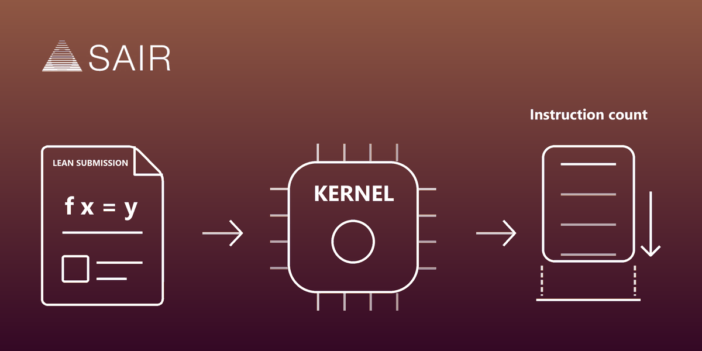

<div align="center">

<a href="https://competition.sair.foundation/competitions/lean-kernel-challenge/overview" title="SAIR Foundation, open the competition"></a>

# Lean Kernel Challenge

**How little work can you leave the kernel, without leaving it anything to doubt?**

<br>

Stage 1 hands you a trusted Lean specification and asks for two things back: an
implementation, and a machine-checked proof that it agrees with the
specification on every input. You are scored on the work a pinned Lean kernel
performs while replaying that artifact. Correctness is the entry fee, not the
score.

<br>

[Documentation](docs/README.md) &nbsp;·&nbsp;
[Stage 1](stage1/README.md) &nbsp;·&nbsp;
[Competition](https://competition.sair.foundation/competitions/lean-kernel-challenge/overview) &nbsp;·&nbsp;
[Discussions](https://github.com/Amey-Thakur/SAIR-LEAN-KERNEL-CHALLENGE/discussions)

<br>

[](https://competition.sair.foundation/competitions/lean-kernel-challenge/overview)
[](https://competition.sair.foundation/competitions/lean-kernel-challenge/overview)
[](https://lean-lang.org/)
[](stage1/lean-toolchain)
[](https://github.com/Amey-Thakur)
[](LICENSE)

<br>

<a href="https://github.com/Amey-Thakur" title="Amey Thakur on GitHub"></a>

</div>

---

<br>

## The task

Stage 1 is co-organised by the **Lean FRO** and the **SAIR Foundation**, with
Joachim Breitner, Leonardo de Moura, Kim Morrison and Terence Tao.

> For each problem the organisers provide a trusted Lean specification.
> Submit an implementation optimised for kernel verification, and a
> machine-checked proof that the implementation agrees with the specification
> on every input.

The judge checks the correctness proof first. Then it measures the work a
**pinned Lean kernel** performs while replaying the whole verified artifact and
the checks generated for judge-selected inputs. Problems span algebra, number
theory, combinatorics, cryptography and discrete mathematics, and are announced
at launch.

> [!IMPORTANT]
> This is not about making code run fast. The compiler is not involved in
> scoring. A `#eval` that returns instantly says nothing, because the kernel
> never sees the compiled code. What counts is how few steps the kernel needs
> when it reduces your definitions while checking your proof.

<br>

## What makes it hard

| Difficulty | Why it bites |
| :--- | :--- |
| **Two objectives at once** | The implementation has to be cheap for the kernel *and* provable against the specification. The cheapest definitions are usually the hardest to prove correct |
| **The kernel is not the compiler** | Reducibility attributes, `@[inline]`, and anything the elaborator does are irrelevant. Only definitional unfolding matters |
| **Proof size is also cost** | The kernel type-checks the proof term. A tactic that closes a goal by producing an enormous term moves the cost rather than removing it |
| **The fast exits are closed** | `native_decide` discharges a goal outside the kernel and leaves `Lean.ofReduceBool` in the axiom list. Under a scoring rule about kernel work, that is not a submission |

<br>

## What is here

The official repository, playground, problem set and submission system arrive
at launch. Until then this holds the parts that do not depend on them.

| Path | What it holds |
| :--- | :--- |
| **[stage1/](stage1/README.md)** | The shape a submission takes: specification, implementation, agreement proof and the kernel-cost demonstrations, as a buildable Lake package |
| **[tools/audit.py](tools/audit.py)** | The two disqualifying checks: no unproved goal, and no goal discharged outside the kernel |
| **[docs/](docs/README.md)** | What the kernel does when it reduces, and where the cost goes |
| **[checker/](checker/README.md)** | An independent proof checker for Lean 4. **Not a Stage 1 entry**, see below |

<br>

## The audit, before anything else

Two things disqualify an artifact regardless of how fast it is, and both are
cheap to rule out.

```bash
python tools/audit.py stage1
```

| Refused | Because |
| :--- | :--- |
| `sorry` | The goal is not proved |
| `native_decide` | The goal was settled by the compiler, outside the kernel, and the axiom list says so |

The axiom list is the real test. A finished artifact should depend on nothing
beyond `propext`, `Classical.choice` and `Quot.sound`. CI reads the output of
`#print axioms` back out of the build and fails on anything else.

<br>

## Build it

```bash
cd stage1 && lake build          # needs elan; the toolchain is pinned
python tools/audit.py stage1     # needs nothing
```

The Lean sources are deliberately small: they are the submission skeleton with
one worked example, not a solution to a problem nobody has seen yet.

<br>

<div align="center">


<sub>The card for the checker in <a href="checker/README.md">checker/</a>, which answers a different question.</sub>

</div>

<br>

## About that checker

> [!WARNING]
> [`checker/`](checker/README.md) is aimed at the
> [Lean Kernel Arena](https://github.com/leanprover/lean-kernel-arena), a
> separate benchmark run by the Lean developers for independent proof checkers.
> It is **not** a Stage 1 entry, and this repository originally treated it as
> one. The arena asks you to *be* the kernel; Stage 1 asks you to give Lean's
> own kernel less to do.

It is kept because it works, and because what it gets right is the thing this
subject turns on: it does not believe the file it is reading. Exports that lie
about their own inductive block, and prove `False` as a result, are rejected.
That is worth having even though it scores nothing here.

<br>

## Key dates

| | |
| :--- | :--- |
| Registration and team formation open | 26 August 2026 |
| Official launch, problems announced | 15 September 2026 |
| Submission deadline | 20 November 2026, 23:59 AoE |
| Stage 2 begins | December 2026 |

Stage 1 is experimental, participants carry their own compute costs, and each
person or organisation may join only one team.

<br>

## Reading further

- [The Lean Kernel Challenge](https://competition.sair.foundation/competitions/lean-kernel-challenge/overview), the competition and its rules
- [Type Checking in Lean 4](https://ammkrn.github.io/type_checking_in_lean4/), what the kernel does, in detail
- [Lean FRO](https://lean-fro.org/), a co-organiser
- [Lean Kernel Arena](https://github.com/leanprover/lean-kernel-arena), the other question, which [checker/](checker/README.md) answers

<br>

---

<div align="center">

**[SAIR Foundation competitions index](https://github.com/Amey-Thakur/SAIR-FOUNDATION-INDEX)**

Every SAIR challenge, what each asks, and where the work lives.

<br>

Prepared by **[Amey Thakur](https://github.com/Amey-Thakur)** &nbsp;·&nbsp;
ORCID [0000-0001-5644-1575](https://orcid.org/0000-0001-5644-1575) &nbsp;·&nbsp;
SAIR [ID 25789315](https://sair.foundation/u/25789315)

<sub>Released under <a href="LICENSE">CC BY 4.0</a>, with citation metadata in <a href="CITATION.cff">CITATION.cff</a>.</sub>

</div>
