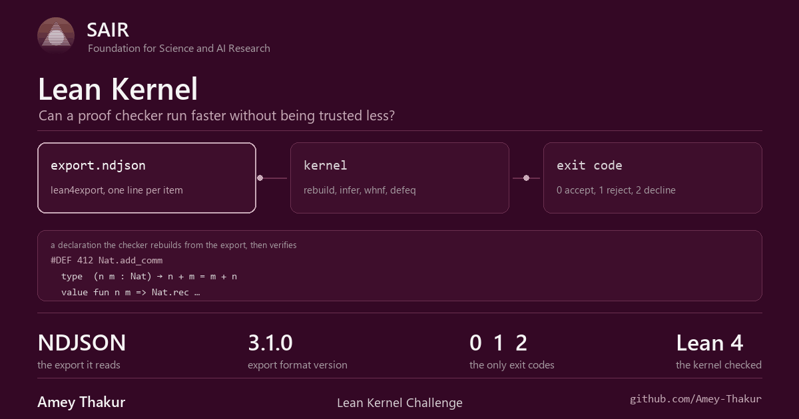
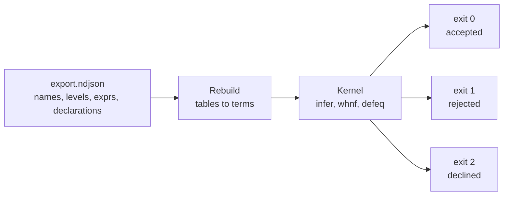

<div align="center">

<a href="https://competition.sair.foundation/competitions/lean-kernel-challenge/overview" title="SAIR Foundation, open the competition"></a>

# Lean Kernel Challenge

**Can a proof checker run faster without being trusted less?**

<br>

A proof is only worth what the thing that checks it is worth. This repository
is an independent checker for Lean 4: it reads an exported environment, rebuilds
every declaration from first principles, and answers with one of three exit
codes and nothing else.

<br>

[Documentation](docs/README.md) &nbsp;·&nbsp;
[Checker](src/README.md) &nbsp;·&nbsp;
[Competition](https://competition.sair.foundation/competitions/lean-kernel-challenge/overview) &nbsp;·&nbsp;
[Discussions](https://github.com/Amey-Thakur/SAIR-LEAN-KERNEL-CHALLENGE/discussions)

<br>

[](https://competition.sair.foundation/competitions/lean-kernel-challenge/overview)
[](https://competition.sair.foundation/competitions/lean-kernel-challenge/overview)
[](https://lean-lang.org/)
[](https://github.com/leanprover/lean4export/blob/master/format_ndjson.md)
[](https://github.com/Amey-Thakur)
[](LICENSE)

<br>

<a href="https://github.com/Amey-Thakur" title="Amey Thakur on GitHub"></a>

</div>

---

<br>

## The problem

Lean 4 is trusted because its kernel is small. Everything above it, the
elaborator, the tactic framework, the macro system, can be as clever as it likes,
because in the end a proof term has to survive a type checker that does not
negotiate.

> Read an exported Lean environment. Rebuild every declaration. Decide whether
> the proofs are well typed, and say so in an exit code.

That makes the kernel the one place in the system where being wrong is fatal and
being slow is expensive at the same time.

Run from the SAIR Foundation, alongside the
[Lean Kernel Arena](https://arena.lean-lang.org/), which benchmarks independent
checkers against a shared suite.

<br>

## Why it is hard

| Difficulty | Why it bites |
| :--- | :--- |
| **No shortcuts** | A checker that trusts the exporter has not checked anything |
| **Definitional equality** | Deciding it needs reduction, and reduction can run for a long time |
| **Universes** | Levels carry constraints of their own, with `max` and `imax` to normalise |
| **Recursors** | Iota reduction has to fire exactly when the major premise is a constructor |
| **Scale** | Mathlib is millions of declarations, so constant factors are the whole game |

The first row is not a slogan. The arena feeds checkers exports that lie: one
smuggles a fabricated recursor into `False`'s inductive block, another declares a
one-field structure as having none so that eta collapses its inhabitants. Both
are proofs of `False`, and neither is caught by getting reduction right. They are
caught by not believing the export.

There is also a structural tension that has nothing to do with speed.

> [!IMPORTANT]
> Every optimisation in a kernel is a claim that two things are the same. A
> cache says a term already checked is still fine. Sharing says two pointers
> mean one value. Fast paths say a cheap test implies an expensive one.
>
> A wrong optimisation does not make the checker slow. It makes it accept a
> false proof, which is the only failure that actually matters.

<br>

## The contract

A checker reads the NDJSON export produced by
[`lean4export`](https://github.com/leanprover/lean4export), format version
**3.1.0**, and answers with an exit code.



| Code | Meaning |
| :--- | :--- |
| `0` | The environment type checks |
| `1` | Something in it does not, and the checker is willing to say so |
| `2` | The checker does not handle this input, and declines rather than guess |
| anything else | A fault in the checker itself |

> [!CAUTION]
> `2` is the honest answer when a feature is unimplemented. Returning `0`
> because nothing was checked is the one outcome a proof checker must never
> produce.

<br>

## What is where

| Path | What it holds |
| :--- | :--- |
| **[docs/](docs/README.md)** | The reading order: the format, the kernel, what is checked and what is declined |
| **[src/](src/README.md)** | The checker: export reader, terms, environment, type checker, harness |
| [src/export_format/](src/export_format/) | The NDJSON reader, and the tables it rebuilds terms from |
| [src/kernel/](src/kernel/) | Names, levels, expressions, the environment, inference, reduction, equality |
| [src/harness/](src/harness/) | The arena contract: read the input, check it, exit `0`, `1` or `2` |
| [tests/](tests/) | What is actually verified, run with `python -m pytest` |

<br>

## Run it

Python 3.10 or newer. No third party packages are required to check an export.

```bash
python -m src.harness.check_export path/to/export.ndjson
echo $?
```

The tests cover the reader and the kernel core:

```bash
python -m pytest tests -q
```

> [!NOTE]
> What is not implemented yet, and what that means for an acceptance, is listed
> in [open questions](docs/research/open_questions.md). The recursor derivation
> is the entry there worth reading first.

The cards in this README are generated, not drawn by hand:

```bash
python .github/scripts/build_animation.py .github/assets
python .github/scripts/build_social_preview.py .github/social-preview.png
```

<br>

## Reading further

- [Lean 4 export format](https://github.com/leanprover/lean4export/blob/master/format_ndjson.md), the specification this reader implements
- [Lean Kernel Arena](https://arena.lean-lang.org/), the benchmark suite for independent checkers
- [Type Checking in Lean 4](https://ammkrn.github.io/type_checking_in_lean4/), what a kernel has to do, in detail
- [Lean4Lean](https://arxiv.org/abs/2403.14064), a Lean type checker verified in Lean

<br>

---

<div align="center">

### SAIR Foundation competitions

| Repository | Challenge |
| :--- | :--- |
| [SAIR-LEAN-KERNEL-CHALLENGE](https://github.com/Amey-Thakur/SAIR-LEAN-KERNEL-CHALLENGE) | An independent proof checker for Lean 4 |
| [SAIR-MODULAR-ARITHMETIC-CHALLENGE](https://github.com/Amey-Thakur/SAIR-MODULAR-ARITHMETIC-CHALLENGE) | Exact modular multiplication by neural induction |
| [SAIR-INVERSE-GALOIS-PROBLEM-IGP24](https://github.com/Amey-Thakur/SAIR-INVERSE-GALOIS-PROBLEM-IGP24) | Inverse Galois Problem in degree 24 |
| [SAIR-MATHEMATICS-DISTILLATION-CHALLENGE](https://github.com/Amey-Thakur/SAIR-MATHEMATICS-DISTILLATION-CHALLENGE) | Equational Theories, Stage 1 and Stage 2 |

<br>

Prepared by **[Amey Thakur](https://github.com/Amey-Thakur)** &nbsp;·&nbsp;
ORCID [0000-0001-5644-1575](https://orcid.org/0000-0001-5644-1575)

<sub>Released under <a href="LICENSE">CC BY 4.0</a>, with citation metadata in <a href="CITATION.cff">CITATION.cff</a>.</sub>

</div>
