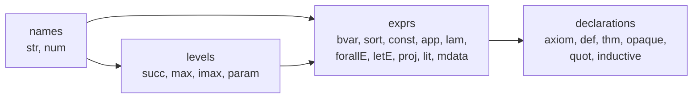

# The export format

**One item per line, three tables, and nothing that may be guessed at.**

[Documentation](../README.md) &nbsp;·&nbsp;
[Reader](../../src/export_format/reader.py) &nbsp;·&nbsp;
[Specification](https://github.com/leanprover/lean4export)

---

[`lean4export`](https://github.com/leanprover/lean4export) writes a Lean
environment as NDJSON, format version **3.1.0**. Every line is one JSON object.
The first is metadata; the rest are either a primitive that lands in a table, or
a declaration built out of them.

Nothing in the file is a term written out in full. Terms are shared by index, so
the file stays small and a term that occurs in a thousand proofs is written once.
That is also why the reader has to be strict: an index it cannot resolve is not a
term it can approximate.

## The three tables

Names, levels and expressions each get their own numbering. Index `0` is
implicit in two of them: it is the anonymous name, and the zero universe.

### Names

A name is a chain, not a string. `Nat.add` is the anonymous name extended by
`Nat` and then by `add`.

| Item | Meaning |
| :--- | :--- |
| `{"in": i, "str": {"pre": p, "str": s}}` | Name `i` is name `p` extended by the component `s` |
| `{"in": i, "num": {"pre": p, "i": k}}` | Name `i` is name `p` extended by the numeral `k` |

Numeric components are not string components that happen to look like digits.
They are generated for internal binders, and conflating the two makes two
distinct constants collide.

### Levels

| Item | Meaning |
| :--- | :--- |
| `{"il": i, "succ": a}` | `a + 1` |
| `{"il": i, "max": [a, b]}` | The larger of the two |
| `{"il": i, "imax": [a, b]}` | `max(a, b)`, except that it is `0` whenever `b` is |
| `{"il": i, "param": n}` | A universe variable named by name `n` |

`imax` is the one that carries weight. It is what makes `Prop` impredicative:
`A → Prop` is a `Prop` however large `A` is, which is why `imax(u, 0) = 0` is a
rule rather than a special case.

### Expressions

Bound variables are de Bruijn indices, so a term carries no names that matter
and alpha equivalence is plain structural equality.

| Item | Meaning |
| :--- | :--- |
| `bvar` | A bound variable, counted outwards from its binder |
| `sort` | `Sort u` for a level `u` |
| `const` | A constant, with the universe arguments it is used at |
| `app` | One application, binary |
| `lam`, `forallE` | A binder, with its domain, its body, and its binder annotation |
| `letE` | A local definition, with its type, its value and its body |
| `proj` | Field `idx` of a structure |
| `natVal`, `strVal` | A literal |
| `mdata` | Metadata wrapped around a term, and semantically transparent |

### Declarations

| Item | What it carries |
| :--- | :--- |
| `axiom` | A type, asserted without proof |
| `def` | A type and a value, unfoldable |
| `thm` | A type and a proof |
| `opaque` | A type and a value that does not unfold |
| `quot` | The quotient primitives |
| `inductive` | Its `types`, their `ctors`, and the `recs` generated for them |

An inductive line is not one declaration. It carries a mutual block: the types,
every constructor of every type, and every recursor, each of which becomes a
constant in its own right. Recursors carry `rules`, one per constructor, each a
`ctor`, an `nfields` and an `rhs` that says what the recursor becomes when it
meets that constructor.

## What the reader is not allowed to do

The reader raises one of two things and never a third.

| Situation | Outcome | Why |
| :--- | :--- | :--- |
| Broken JSON, a bad shape, an index used before it was defined | `MalformedExport` → exit `1` | This is not an export |
| A well formed item this version does not know | `UnsupportedExport` → exit `2` | Later formats add items; skipping one means checking an environment that is missing part of itself |

There is no third branch where an unrecognised line is ignored. Ignoring lines
is how a reader ends up building something the exporter did not write, and
everything above it then verifies the wrong environment perfectly.

> [!IMPORTANT]
> The reader decides what the environment *is*. It never decides whether the
> environment is *true*. Keeping those apart is what stops a parsing bug from
> becoming a false acceptance: a term the reader gets wrong is a term the kernel
> then refuses, rather than a term nobody looked at.

**[Back to the documentation](../README.md)** &nbsp;·&nbsp;
**[On to the kernel](../../../docs/research/kernel.md)**
