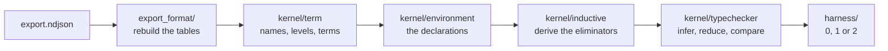

<div align="center">

# The checker

**Four layers, and only one of them is allowed to say yes.**

[Back to the repository](../README.md) &nbsp;·&nbsp;
[Documentation](../docs/README.md) &nbsp;·&nbsp;
[Arena](https://arena.lean-lang.org/)

</div>

---

Each directory knows as little as it can about the others. The reader does not
know what a well typed term is, the kernel does not know what an exit code is,
and the harness does not know what either of them is doing. That is not tidiness
for its own sake. It is what makes a parsing bug show up as a rejection rather
than as a quiet acceptance.



## What each directory does

| Directory | Contents | Why it exists |
| :--- | :--- | :--- |
| [export_format/](export_format/) | [reader](export_format/reader.py) | Rebuilds an environment from the NDJSON export and refuses anything it does not recognise. It never decides whether that environment is true |
| [kernel/](kernel/) | [term](kernel/term.py), [environment](kernel/environment.py), [inductive](kernel/inductive.py), [typechecker](kernel/typechecker.py) | Terms in de Bruijn form, the declarations they make up, what an inductive block is entitled to declare, and the only code whose correctness the answer depends on |
| [harness/](harness/) | [check_export](harness/check_export.py) | Turns a run into the one thing the arena reads: an exit code |

## The three files that matter

| File | What it owns |
| :--- | :--- |
| [term.py](kernel/term.py) | Hierarchical names, universe levels with `max` and `imax`, expressions with de Bruijn indices, and the shifting and substitution everything else folds over. All of it immutable, which is what will make caching sound later |
| [environment.py](kernel/environment.py) | One declaration per constant, in export order, and a store that answers lookups and nothing else |
| [inductive.py](kernel/inductive.py) | Derives an inductive block's eliminators, their rules, their field counts and their elimination universe from the types alone, and checks the export against what it derived |
| [typechecker.py](kernel/typechecker.py) | Weak head normalisation with beta, zeta, delta and iota; definitional equality with eta and proof irrelevance; inference for the core term language |

## The rule that shapes everything

Definitional equality is decided by three strategies, tried cheapest first:
structural comparison of the heads, then eta, then proof irrelevance.

None of them may return `False` on its own. A strategy that fails has not shown
the two terms are different, only that it could not show they are the same, so
it hands the question to the next one. Getting this wrong does not cause a
crash. It causes a checker that rejects correct proofs, and the version of the
same mistake in the other direction accepts false ones.

## Reduction, and when to stop

`whnf` reduces only far enough to expose a head, because that is all definitional
equality ever needs to look at. It runs on a fuel budget, and exhausting it
raises `Declined` rather than looping.

That choice is deliberate. A kernel meets terms whose normal forms do not exist,
and a checker that runs until the arena kills it has produced no answer at all.
`2` is an answer.

## Run it

```bash
python -m src.harness.check_export path/to/export.ndjson
echo $?
```

Or as the arena calls it, with the input named by the environment:

```bash
IN=path/to/export.ndjson python -m src.harness.check_export
```

Then the tests, which cover the reader, the term arithmetic, the kernel and the
exit codes:

```bash
python -m pytest tests -q
```

## What is not taken on trust

An inductive block arrives carrying its own recursors and a set of integers
describing them. None of that is used as given. The eliminators are derived from
the inductive types, and the export is checked against the derivation, because a
checker that registers exported recursors as it finds them ends up holding an
inhabitant of the empty type. The same applies to constructor field counts, to
the elimination universe, and to the `k` flag.

Declarations are also admitted in dependency order. Lean's kernel gets that for
free by adding one declaration at a time; reading a whole export first loses it,
and losing it means `def loop : False := loop` checks against its own declared
type.

> [!IMPORTANT]
> Structure projections, nested inductives and unsafe declarations are not
> implemented, and are declined rather than assumed. Every unimplemented case in
> this repository raises `Declined`, never `Rejected` and never nothing, so an
> export this checker has not really read can never leave with `0`.

**[Back to the repository](../README.md)** &nbsp;·&nbsp;
**[Read the documentation](../docs/README.md)**
