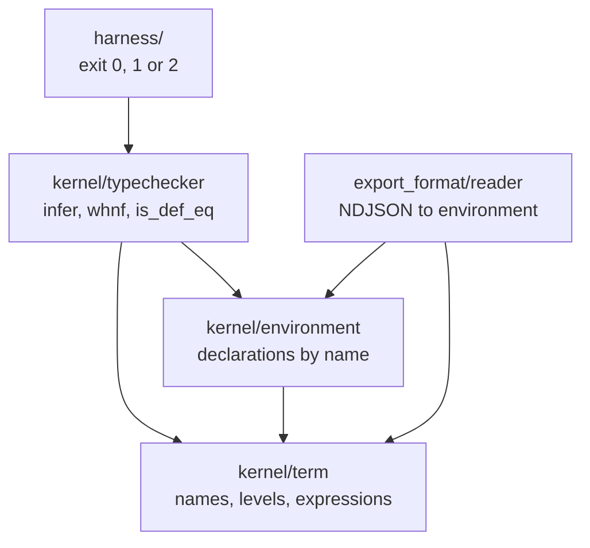

# Architecture

**What each layer is responsible for, and what it is not allowed to know.**

[Documentation](README.md) &nbsp;·&nbsp;
[Checker](../src/README.md) &nbsp;·&nbsp;
[Rationale](design_rationale.md)

---

Four layers, in one direction. Nothing calls upwards.

## The layers

| Layer | Knows about | Deliberately does not know about |
| :--- | :--- | :--- |
| [term.py](../src/kernel/term.py) | De Bruijn indices, universe levels, substitution | Environments, declarations, typing |
| [environment.py](../src/kernel/environment.py) | Declarations and their order | Whether any of them is well typed |
| [reader.py](../src/export_format/reader.py) | The NDJSON format | What a well typed term is |
| [typechecker.py](../src/kernel/typechecker.py) | Inference, reduction, equality | Files, exit codes, the arena |
| [check_export.py](../src/harness/check_export.py) | The arena contract | How any of the above works |

## Why the reader is kept out of the kernel

The reader is the only part that touches untrusted input, and it is the part
most likely to contain a bug. Keeping it below the kernel means a reader bug
produces a term the kernel then refuses, rather than a term the kernel never
sees.

The alternative, where parsing and checking are interleaved for speed, makes the
two failure modes indistinguishable: an item skipped during parsing and an item
that checked successfully both leave no trace.

## Why the environment is deliberately dumb

`Environment` stores declarations and answers lookups. It does not validate,
order, deduplicate for convenience, or fill in defaults.

Every one of those would be a place where an environment could differ from what
the exporter wrote without anything noticing. It refuses a duplicate name, and
otherwise it holds exactly what it was given.

## Where the answer is decided

One method, [`check_declaration`](../src/kernel/typechecker.py), and it does two
things: the declared type must itself be a type, and the value, if there is one,
must inhabit it. Everything else in the kernel exists to make those two
questions answerable.

The harness turns the result into an exit code and adds nothing to it.

## What the tests are for

| File | What it pins down |
| :--- | :--- |
| [test_term.py](../tests/test_term.py) | Shifting and substitution, where an off-by-one changes which variable a proof is about without failing |
| [test_reader.py](../tests/test_reader.py) | That leniency is absent: forward references, unknown items and truncation all raise |
| [test_typechecker.py](../tests/test_typechecker.py) | What is accepted, and in equal measure what is refused |
| [test_harness.py](../tests/test_harness.py) | That no path from an unread input reaches `0` |

Half of the type checker tests are refusals on purpose. A checker that only ever
accepts passes every acceptance test perfectly.

**[Back to the documentation](README.md)** &nbsp;·&nbsp;
**[On to the rationale](design_rationale.md)**
