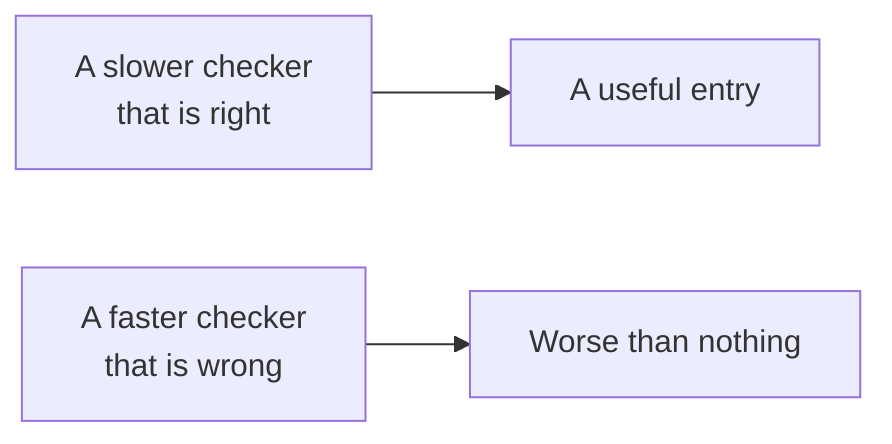

# The competition

**What is submitted, how it is invoked, and what an exit code commits you to.**

[Documentation](../README.md) &nbsp;·&nbsp;
[Checker](../../src/README.md) &nbsp;·&nbsp;
[Competition](https://competition.sair.foundation/competitions/lean-kernel-challenge/overview) &nbsp;·&nbsp;
[Arena](https://arena.lean-lang.org/)

---

## The task in one sentence

Improve the performance of verified computation in the Lean 4 kernel, by writing
a checker that reads an exported Lean environment and decides whether it is well
typed.

## What a submission is

A package of kind `lean-kernel-package`. It is not a notebook and not a set of
answers: it is a program that will be run against inputs the submitter does not
see, and judged on what it does with them.

That single fact rules out the shape most competition entries take. There is no
test set to fit, no scoring function to game, and nothing to tune against a
public leaderboard. The only thing that transfers from a local run to a graded
one is whether the checker is actually right.

## How it is invoked

The [Lean Kernel Arena](https://arena.lean-lang.org/) benchmarks independent
checkers against a shared suite. An entry is handed one export at a time:

| | |
| :--- | :--- |
| **Input** | An NDJSON file produced by [`lean4export`](https://github.com/leanprover/lean4export), one item per line |
| **How it arrives** | Named by the `IN` environment variable |
| **What is measured** | Whether the answer is right, and how long it took |
| **How the answer is given** | The process exit code, and nothing else |

## The three exit codes

| Code | Name | What it claims |
| :--- | :--- | :--- |
| `0` | accepted | Every declaration in this export type checks |
| `1` | rejected | Something in it does not, and the checker is willing to stand behind that |
| `2` | declined | The checker does not handle this input |

The three are not a severity scale. They are three different claims, and the
third one is the reason the design is honest.

> [!CAUTION]
> `0` is the strongest statement a proof checker can make. It says every
> declaration was rebuilt and verified. A checker that skips an item it did not
> recognise and exits `0` has made that statement about an environment it never
> read.

`2` costs nothing but the benchmark entry. `0` on an unread file costs the thing
the whole exercise exists for. Every unimplemented case in this repository
raises `Declined`, and the harness has no path from an unread item to `0`.

## What that implies about optimisation

The whole competition is a performance competition where the constraint is
soundness. That inverts the usual order of work.

A wrong optimisation in a kernel does not make it slow, and does not make it
crash. It makes it accept a term that does not type check, which is the failure
that cannot be detected from the outside, because a false acceptance and a true
one produce the same exit code.

So the order here is: correct, then declining honestly where it is not complete,
then fast. Every speed change has to come with an argument for why the thing it
skips was redundant, and the tests exist to make the argument checkable.

## What is deliberately not attempted

| Not done | Why |
| :--- | :--- |
| Structure projections | Not implemented, so declined rather than approximated |
| Unsafe declarations | Outside what a kernel is supposed to trust |
| Fitting anything to a public leaderboard | There is nothing to fit: the inputs are unseen and the judgement is binary |

**[Back to the documentation](../README.md)** &nbsp;·&nbsp;
**[On to the export format](../research/export_format.md)**
