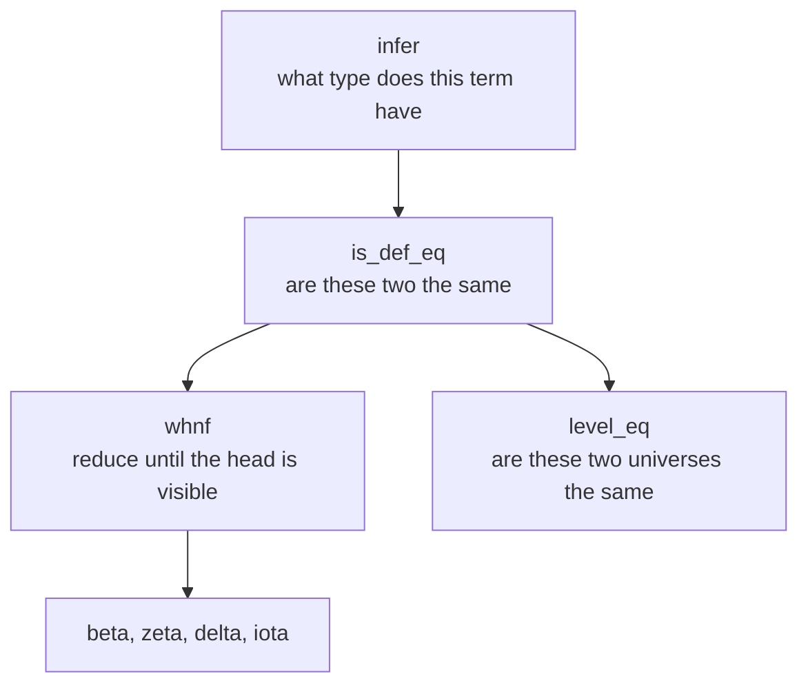

# What a kernel is

**Four jobs, and each one is where the time goes.**

[Documentation](../README.md) &nbsp;·&nbsp;
[Type checker](../../src/kernel/typechecker.py) &nbsp;·&nbsp;
[Reference](https://ammkrn.github.io/type_checking_in_lean4/)

---

A kernel answers one question: does this term have this type. Everything it does
is in service of that, and almost all of the cost is in one sub-question, which
is whether two terms are the same.

## 1. Reduction

`whnf` reduces a term only far enough to expose its head, because that is all
equality ever needs to look at. Four rules do the work.

| Rule | What it does | Where it hurts |
| :--- | :--- | :--- |
| **beta** | Applies a lambda to an argument | Cheap, and constant factors dominate |
| **zeta** | Substitutes a `let` away | Cheap, but duplicates the value at every use |
| **delta** | Unfolds a definition to its value | The expensive one: an unfold can be enormous, and most of them turn out to be unnecessary |
| **iota** | Fires a recursor whose major premise is a constructor | Needs the major premise reduced first, which is where recursion goes deep |

Delta is where a kernel wins or loses. Unfolding eagerly is correct and slow.
Not unfolding is fast and incomplete. Every real kernel is a set of heuristics
about which unfolds to try first, and each heuristic is only allowed if failing
to unfold cannot change the answer.

## 2. Definitional equality

Three strategies, tried cheapest first.

| Strategy | What it settles |
| :--- | :--- |
| **Structural** | Same head, same arguments, pairwise equal |
| **Eta** | `fun x => f x` is `f`, for any `f` of function type |
| **Proof irrelevance** | Any two proofs of one proposition are the same proof |

The rule that matters is that none of the three may answer `False` on its own.
A strategy that fails has shown nothing except that it could not settle the
question, so it hands it on. A structural comparison that returns `False`
directly turns eta and proof irrelevance into dead code, and the checker starts
rejecting correct proofs. The mistake is easy to make and produces no error.

Proof irrelevance is worth its own note. It requires inferring the types of both
sides and checking they are propositions, which is the most expensive test in the
list, but without it a kernel rejects perfectly good terms that differ only in
which proof was supplied.

## 3. Universes

Levels are their own little language: zero, successor, `max`, `imax`, and
variables. Two levels are equal when they are equal for every assignment of
those variables, so comparison is not structural.

Enough normalisation to decide what a kernel actually meets:

| Rule | Why |
| :--- | :--- |
| `imax(a, 0) = 0` | The impredicativity of `Prop` |
| `imax(a, b+1) = max(a, b+1)` | A known successor is never zero |
| `max(a, a+k) = a+k` | Fold when both sides share a base |

Get `imax` wrong and a `Pi` type into `Prop` lands in `Type`, which does not
crash and does not obviously misbehave. It just stops being the logic anyone
meant.

## 4. Recursors

Iota reduction fires a recursor when its major premise reduces to a constructor
application. The recursor's own rule for that constructor is instantiated at the
recursor's universes, applied to the parameters, motives and minor premises, then
to the constructor's fields, then to whatever came after the major premise.

The arithmetic of which arguments go where is entirely mechanical and entirely
unforgiving. Off by one on the major premise position and the recursor either
never fires, which makes the checker incomplete, or fires on the wrong argument,
which makes it wrong.

## 5. Inductive blocks, which are not the kernel's to take on trust

An export hands over an inductive block already carrying its constructors and its
recursors, together with a set of integers: how many parameters, how many
indices, how many fields each constructor has, how many minor premises the
eliminator takes, whether it is K-like.

None of that is evidence. All of it is derivable from the inductive types alone,
and a kernel derives it.

| Derived from the types | Not read from the export |
| :--- | :--- |
| Which recursors may exist, and their names | An exported recursor with any other name |
| The eliminator's type | Its declared type, which is compared against the derived one |
| Each rule's field count and right hand side | The `nfields` and `rhs` as given |
| `numParams`, `numIndices`, `numMotives`, `numMinors` | The declared integers |
| Whether the block may eliminate large, and whether it is K-like | The declared `k` |

Three separate checks sit alongside the derivation, each guarding a different way
of proving `False`.

**Strict positivity.** A constructor field may mention the type being defined
only as its own result. An occurrence to the left of an arrow permits a fixed
point, and a fixed point over `False` is a proof of it.

**The universe bound.** Every field must live in a universe the inductive
reaches, unless the inductive is a `Prop`, where impredicativity makes the
constraint vacuous. Without the bound, a universe can hold something the size of
itself.

**Large elimination.** A `Prop` may only eliminate outside `Prop` when it is a
syntactic subsingleton: no constructors, or exactly one whose every field is
either a proof or an index of the result. Otherwise proof irrelevance makes its
inhabitants equal, and an eliminator that could tell them apart proves `False`.

> [!CAUTION]
> The subtlety in the last one is the meaning of "is a `Prop`". A type declared
> at `Sort u`, for a universe parameter `u`, is not a `Prop` syntactically, but
> it becomes one at `u := 0`. A checker whose "is this level surely non-zero"
> test answers yes for a parameter hands such a type a large eliminator, and the
> `u := 0` instance then proves `False`. The test must answer no.

## Where the time actually goes

| Cost | Scale |
| :--- | :--- |
| Definitional equality | The overwhelming majority of a real run |
| Delta unfolding inside it | The overwhelming majority of that |
| Reading the export | Linear, and irrelevant next to the above |

Which is why the interesting optimisations are all forms of not doing work:
caching what has already been compared, sharing terms so pointer equality
settles cases early, and refusing to unfold when the answer cannot depend on it.

Each of those is a claim that two things are the same, and none of the claims is
checked by anything. That is the whole difficulty of this competition.

**[Back to the documentation](../README.md)** &nbsp;·&nbsp;
**[On to the rationale](../design_rationale.md)**
