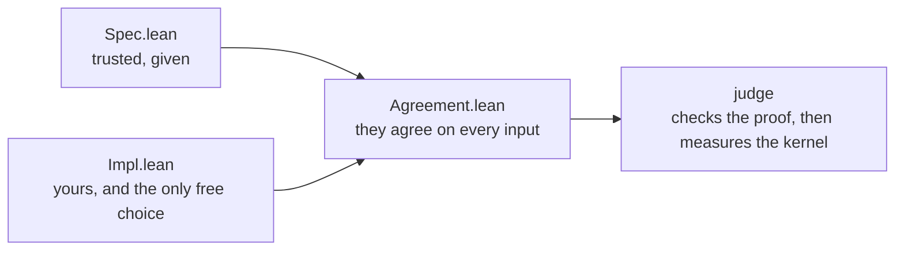

<div align="center">

# Stage 1

**Specification, implementation, agreement. In that order, and the middle one is the only one you choose.**

[Back to the repository](../README.md) &nbsp;·&nbsp;
[Documentation](../docs/README.md) &nbsp;·&nbsp;
[Competition](https://competition.sair.foundation/competitions/lean-kernel-challenge/overview)

</div>

---

A submission is three things. The organisers give you the first, you write the
second, and the third is what makes the second admissible.



| File | What it is |
| :--- | :--- |
| [Stage1/Spec.lean](Stage1/Spec.lean) | The specification. Written to be obviously right, not fast, and not yours to change |
| [Stage1/Impl.lean](Stage1/Impl.lean) | The implementation. Cheap for the kernel to reduce, which is the whole competition |
| [Stage1/Agreement.lean](Stage1/Agreement.lean) | The proof that the two agree at every input |
| [Stage1/Cost.lean](Stage1/Cost.lean) | Kernel-cost facts, written as proofs so the build checks them |

## The worked example

Doubling, which is small enough to read in one sitting and still shows the
shape of the problem.

| | Definition | What the kernel does at `n` |
| :--- | :--- | :--- |
| Specification | recursion on the structure | unfolds `n` times |
| Implementation | `2 * n` | one multiplication on a literal |

`Nat` literals are backed by GMP in the kernel, so the implementation costs
roughly the same whatever `n` is, while the specification costs more the larger
`n` gets. The gap is the entire idea, and a real problem is this with the
arithmetic replaced by something worth optimising.

## Build it

```bash
lake build
```

The toolchain is pinned in [lean-toolchain](lean-toolchain). The package has no
dependencies, including no Mathlib, so the build is fast and the artifact is
small.

## What disqualifies a submission

> [!CAUTION]
> `native_decide` evaluates with the compiler, outside the kernel, and records
> `Lean.ofReduceBool` in the axiom list. Under a scoring rule that measures the
> work a kernel performs, a goal closed that way has not been checked by the
> thing doing the scoring.

Run the audit before submitting anything:

```bash
python ../tools/audit.py .
```

It refuses `sorry` and `native_decide` in the sources, and, given the build
output, refuses any axiom beyond `propext`, `Classical.choice` and
`Quot.sound`. CI runs both halves on every push.

## What is not here yet

The problems. They are announced at the launch on **15 September 2026**, along
with the official repository, the playground and the submission format. What is
here is the skeleton they drop into, so that the first day is spent on the
mathematics rather than on the scaffolding.

**[Back to the repository](../README.md)** &nbsp;·&nbsp;
**[Read the documentation](../docs/README.md)**
